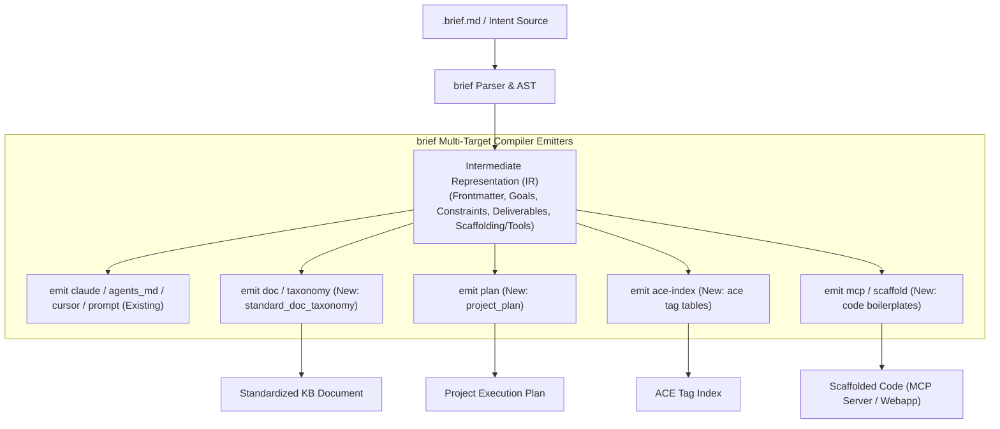

```mermaid
flowchart TD
        A[".brief.md / Intent Source"] --> B["brief Parser & AST"]
        B --> C["Intermediate Representation (IR)\n(Frontmatter, Goals, Constraints, Deliverables, Scaffolding/Tools)"]
        
        subgraph Emitters ["brief Multi-Target Compiler Emitters"]
            C --> D1["emit claude / agents_md / cursor / prompt (Existing)"]
            C --> D2["emit doc / taxonomy (New: standard_doc_taxonomy)"]
            C --> D3["emit plan (New: project_plan)"]
            C --> D4["emit ace-index (New: ace tag tables)"]
            C --> D5["emit mcp / scaffold (New: code boilerplates)"]
        end
    
        D2 --> F1["Standardized KB Document"]
        D3 --> F2["Project Execution Plan"]
        D4 --> F3["ACE Tag Index"]
        D5 --> F4["Scaffolded Code (MCP Server / Webapp)"]
```